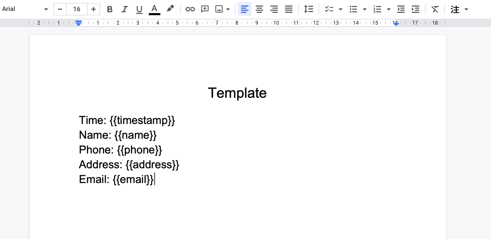

# Useful google app scripts

The collection of useful google app scripts..

***

## Table of Contents

* [Auto send email from forms](#auto-send-email-from-forms)

***

## Auto send email from forms

### 一、建立基本檔案

此 script 的功能在於，使用者填完 google form 後，可以將表單的內容填入事前自定義好的 google 文件，並另存為 pdf 檔，同時將該 pdf 檔 email 給填表人。

我們先在 google drive 中建立兩份文件：

* Google doc (要使用的模板文件)

* Google sheet (建立並導入 google form)

接著開啟建立好的試算表，基於此試算表建立新的表單。這邊表單內容依據模板文件，請填表人輸入姓名、電話、地址及電子郵件。而這些表單資料，將會填入我們事先建立好的模板文件所指定的位置當中。

### 二、設置 google app scrips

同樣再次開啟建立好的試算表，於上方擴充功能開啟 app scripts，並將此 [程式碼](send-email-from-forms.js) 複製到**程式碼.gs**中。

接著，設定觸發條件 (trigger)，這邊選擇設定「表單提交時」觸發。

```json
{
  "authMode": "FULL",
  "namedValues": {
    "姓名": [
      "蔣安安"
    ],
    "時間戳記": [
      "2022/11/28 下午 3:35:16"
    ],
    "住址": [
      "台北市信義區市府路1號"
    ],
    "電話": [
      "0911222333"
    ],
    "電子郵件": [
      "xxxxxxxx@gmail.com"
    ]
  },
  "range": {
    "columnEnd": 5,
    "columnStart": 1,
    "rowEnd": 25,
    "rowStart": 25
  },
  "source": {},
  "triggerUid": "xxxxxxx",
  "values": [
    "2022/11/28 下午 3:35:16",
    "蔣安安",
    "0911222333",
    "台北市信義區市府路1號",
    "xxxxxxxx@gmail.com"
  ]
}
```

表單提交後，會生成一個 event object，而我們要取得的部分是 values，即表單的內容，資料型態為 array，因此在程式碼中我們用以下方式來提取資料：

```js
function myFunction(event) {
    // 紀錄提交表單之 log 檔
    Logger.log(JSON.stringify(event, null, 2))

    // 取得 google 表單資料
    let formData = event.values;
    let timeStamp = formData[0]; // 表單自動生成的時間戳記
    let name = formData[1];
    let phone = formData[2];
    let address = formData[3];
    let email = formData[4];
    ......
 }
```

### 三、設置 oauthScopes

由於自動發送 email 需要取得權限，權限設定方式請參考 google 官方文檔：

1. [Setting explicit scopes](https://developers.google.com/apps-script/concepts/scopes#setting_explicit_scopes)

2. [Class MailApp](https://developers.google.com/apps-script/reference/mail/mail-app)
